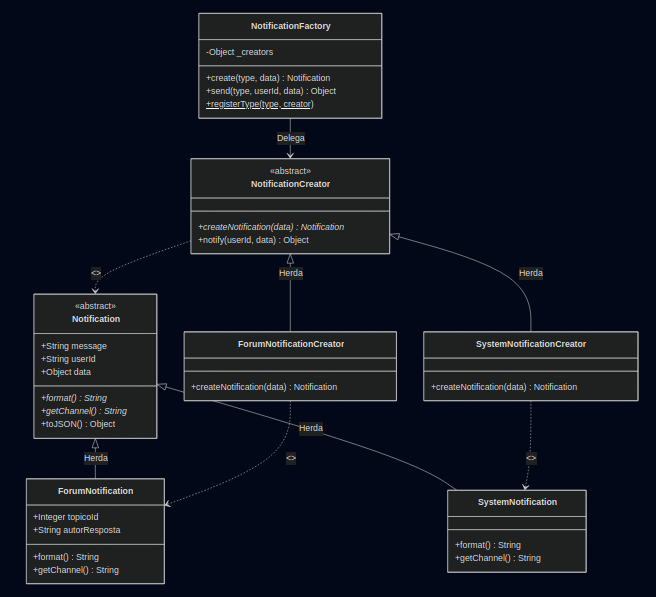

# 3.1.1 Factory Method

## 1. Introdução ao Padrão Factory Method

O padrão de projeto **Factory Method** é um padrão criacional que define uma interface para criar objetos, mas permite que as subclasses decidam qual classe concreta instanciar (Gamma et al., 1995). Dessa forma, a criação de objetos é delegada às subclasses, desacoplando o código cliente dos tipos concretos produzidos.

Esse padrão é indicado quando uma classe não pode antecipar qual tipo de objeto precisa criar, ou quando se deseja que subclasses especializem o processo de criação sem alterar a lógica de uso.

---

### 1.1. Problema que o Factory Method Resolve

Em sistemas com múltiplos tipos de objetos relacionados, instanciar diretamente classes concretas espalha a lógica de criação por todo o código e gera forte acoplamento. Qualquer adição de um novo tipo exige modificações em diversos pontos.

O padrão Factory Method resolve os seguintes problemas (Refactoring Guru, [s.d.]):

* **Desacoplamento da Criação:** O código cliente trabalha com a interface abstrata (Product), sem conhecer os tipos concretos.
* **Extensibilidade:** Novos tipos de produto podem ser adicionados criando-se apenas novas subclasses de Creator e Product, respeitando o princípio Aberto/Fechado (OCP).
* **Delegação de Responsabilidade:** Cada Creator concreto encapsula a lógica de instanciação do seu tipo específico de Product.

---

### 1.2. Estrutura e Participantes

Os principais participantes do padrão Factory Method são:

| Participante | Descrição | No Código |
|---|---|---|
| **Product** | Interface/classe abstrata que define o contrato dos objetos criados | `Notification` |
| **ConcreteProduct** | Implementação concreta do Product | `ForumNotification`, `IDENotification`, `AchievementNotification`, `SystemNotification` |
| **Creator** | Classe abstrata que declara o Factory Method | `NotificationCreator` |
| **ConcreteCreator** | Implementação que sobrescreve o Factory Method para retornar um ConcreteProduct | `ForumNotificationCreator`, `IDENotificationCreator`, `AchievementNotificationCreator`, `SystemNotificationCreator` |

---

### 1.3. Variações Comuns

* **Simple Factory (Fábrica Simples):** Uma classe utilitária que centraliza a criação com base em parâmetros (ex.: string de tipo). É um padrão relacionado, porém não é o Factory Method clássico do GoF.
* **Abstract Factory:** Estende o conceito para famílias inteiras de objetos relacionados. Enquanto o Factory Method foca em um único tipo de produto, o Abstract Factory cria múltiplos tipos coordenados.
* **Factory Method + Registro:** Combina o padrão com um mapa de tipos registrados, permitindo extensibilidade dinâmica em tempo de execução.

---

### 1.4. Diagrama UML

*Figura 1: Representação UML genérica do Padrão Factory Method (Refactoring Guru, [s.d.])*

<center>
  
</center>

---

*Figura 2: Modelagem Aplicada — Factory Method no Sistema de Notificações do ConhecendoIA (foco nos participantes base: Creator, ConcreteCreator, Product, ConcreteProduct)*

<center>
  
</center>

Neste diagrama instanciado, os participantes do padrão estão mapeados diretamente ao domínio do projeto:

| Participante GoF | Classe no Projeto |
|---|---|
| **Creator** | `NotificationCreator` |
| **ConcreteCreator** | `ForumNotificationCreator` |
| **Product** | `Notification` |
| **ConcreteProduct** | `ForumNotification` |

---

*Figura 3: Diagrama UML completo — Arquitetura de Notificações com todos os Concrete Products e Creators*

<center>
  
</center>

*Autor: Grupo 3 - ConhecendoIA, 2026.*

---

### 1.5. Como Funciona

1. O **código cliente** (ex.: módulo do Fórum, IDE Python) solicita o envio de uma notificação.
2. O cliente chama o método `notify(userId, data)` de um **Creator** concreto (ex.: `ForumNotificationCreator`).
3. Internamente, `notify()` invoca o **Factory Method** `createNotification(data)`, que é implementado pela subclasse.
4. A subclasse cria e retorna o **Product** concreto adequado (ex.: `ForumNotification`).
5. O `notify()` utiliza o Product retornado para formatar e enviar a notificação, sem conhecer sua classe concreta.

---

### 1.6. Benefícios

* **Desacoplamento:** O código cliente depende apenas das interfaces `Notification` e `NotificationCreator`, não dos tipos concretos.
* **Extensibilidade:** Novos tipos de notificação são adicionados criando novas subclasses, sem modificar código existente (OCP).
* **Responsabilidade Única:** Cada Creator se responsabiliza pela criação do seu tipo de Product (SRP).
* **Testabilidade:** Mocks e stubs podem substituir Creators concretos em testes unitários.

---

### 1.7. Desvantagens

* **Aumento de classes:** Cada novo tipo de notificação exige uma classe Product e uma classe Creator, aumentando a quantidade de código.
* **Complexidade:** Para sistemas com poucos tipos de objetos, o padrão pode ser uma abstração desnecessária.
* **Hierarquia paralela:** As hierarquias de Product e Creator devem ser mantidas sincronizadas.

---

## 2. Aplicação do Padrão Factory Method no Projeto "ConhecendoIA"

No projeto **ConhecendoIA**, o Factory Method é aplicado ao **sistema de notificações**, onde diferentes módulos da plataforma geram notificações com características distintas.

**Localização:** `frontend/src/patterns/NotificationFactory.js`

---

### 2.1. Contexto do Problema

A plataforma ConhecendoIA possui funcionalidades diversas que geram notificações para os usuários:

| Módulo | Ação do Usuário | Tipo de Notificação | Características |
|---|---|---|---|
| **Fórum** | Resposta a um tópico | `ForumNotification` | Ícone 💬, prioridade normal, link para o tópico |
| **IDE Python** | Execução de código | `IDENotification` | Ícone 🐍, prioridade baixa, resultado da execução |
| **Gamificação** | Conquista de badge/XP | `AchievementNotification` | Ícone 🏆, prioridade alta, detalhes da conquista |
| **Sistema** | Alerta administrativo | `SystemNotification` | Ícone ⚠️, prioridade crítica, mensagem admin |

Sem o Factory Method, cada módulo precisaria conhecer e instanciar diretamente a classe concreta de notificação, gerando acoplamento forte e dificultando a manutenção. Adicionar um novo tipo (ex.: notificação de Quiz) exigiria alterações em múltiplos pontos do código.

---

### 2.2. Solução com o Factory Method

A solução organiza o código em duas hierarquias paralelas:

**Hierarquia de Products (Notificações):**

```
Notification (abstrata)
├── ForumNotification        — ícone 💬, canal in-app
├── IDENotification          — ícone 🐍, canal in-app
├── AchievementNotification  — ícone 🏆, canal in-app+push
└── SystemNotification       — ícone ⚠️, canal in-app+email
```

**Hierarquia de Creators (Fábricas):**

```
NotificationCreator (abstrata)
├── ForumNotificationCreator
├── IDENotificationCreator
├── AchievementNotificationCreator
└── SystemNotificationCreator
```

Cada Creator implementa o Factory Method `createNotification(data)` retornando a instância concreta adequada.

---

### 2.3. Implementação

#### Classe Abstrata `Notification` (Product)

Define a interface comum a todas as notificações. Métodos `format()` e `getChannel()` são abstratos — cada subclasse os implementa de forma específica.

```javascript
class Notification {
  constructor({ message, userId, data = {} }) {
    if (new.target === Notification) {
      throw new Error(
        "Notification é uma classe abstrata e não pode ser instanciada diretamente."
      );
    }
    this.message = message;
    this.userId = userId;
    this.data = data;
    this.timestamp = new Date().toISOString();

    // Propriedades abstratas — sobrescritas pelas subclasses
    this.type = "base";
    this.icon = "📢";
    this.priority = "normal";
  }

  format() {
    throw new Error("Método abstrato format() deve ser implementado.");
  }

  getChannel() {
    throw new Error("Método abstrato getChannel() deve ser implementado.");
  }

  toJSON() {
    return {
      type: this.type,
      icon: this.icon,
      priority: this.priority,
      message: this.message,
      userId: this.userId,
      timestamp: this.timestamp,
      channel: this.getChannel(),
      formatted: this.format(),
      data: this.data,
    };
  }
}
```

---

#### Concrete Products — Exemplos

**`ForumNotification`** — notificações do Fórum:

```javascript
class ForumNotification extends Notification {
  constructor({ message, userId, data = {} }) {
    super({ message, userId, data });
    this.type = "forum";
    this.icon = "💬";
    this.priority = "normal";
    this.topicoId = data.topicoId || null;
    this.autorResposta = data.autorResposta || "Anônimo";
  }

  format() {
    const topico = this.topicoId ? ` no tópico #${this.topicoId}` : "";
    return `${this.icon} [Fórum] ${this.autorResposta} respondeu${topico}: "${this.message}"`;
  }

  getChannel() {
    return "in-app";
  }
}
```

**`AchievementNotification`** — conquistas de gamificação:

```javascript
class AchievementNotification extends Notification {
  constructor({ message, userId, data = {} }) {
    super({ message, userId, data });
    this.type = "achievement";
    this.icon = "🏆";
    this.priority = "alta";
    this.badge = data.badge || null;
    this.xp = data.xp || 0;
  }

  format() {
    const badgeText = this.badge ? ` Badge: "${this.badge}".` : "";
    const xpText = this.xp > 0 ? ` +${this.xp} XP!` : "";
    return `${this.icon} [Conquista] ${this.message}${badgeText}${xpText}`;
  }

  getChannel() {
    return "in-app+push";
  }
}
```

---

#### Classe Abstrata `NotificationCreator` (Creator)

Define o Factory Method `createNotification(data)` e o método `notify()` que o utiliza:

```javascript
class NotificationCreator {
  constructor() {
    if (new.target === NotificationCreator) {
      throw new Error(
        "NotificationCreator é abstrata e não pode ser instanciada diretamente."
      );
    }
  }

  // Factory Method — implementado pelas subclasses
  createNotification(data) {
    throw new Error("Factory Method createNotification() deve ser implementado.");
  }

  // Operação que utiliza o Factory Method
  notify(userId, data) {
    const notification = this.createNotification({ ...data, userId });
    const payload = notification.toJSON();

    console.log(`\n📤 Enviando notificação via [${payload.channel}]...`);
    console.log(`   Para: Usuário ${userId}`);
    console.log(`   Tipo: ${payload.type} | Prioridade: ${payload.priority}`);
    console.log(`   ${payload.formatted}`);

    return { success: true, notification: payload };
  }
}
```

---

#### Concrete Creators

Cada Creator implementa o Factory Method retornando o Product adequado:

```javascript
class ForumNotificationCreator extends NotificationCreator {
  createNotification(data) {
    return new ForumNotification(data);
  }
}

class IDENotificationCreator extends NotificationCreator {
  createNotification(data) {
    return new IDENotification(data);
  }
}

class AchievementNotificationCreator extends NotificationCreator {
  createNotification(data) {
    return new AchievementNotification(data);
  }
}

class SystemNotificationCreator extends NotificationCreator {
  createNotification(data) {
    return new SystemNotification(data);
  }
}
```

---

#### `NotificationFactory` — Fachada utilitária

Classe utilitária que simplifica o uso, mapeando tipos (strings) para Creators:

```javascript
class NotificationFactory {
  static _creators = {
    forum: new ForumNotificationCreator(),
    ide: new IDENotificationCreator(),
    achievement: new AchievementNotificationCreator(),
    system: new SystemNotificationCreator(),
  };

  static create(type, data) {
    const creator = NotificationFactory._creators[type];
    if (!creator) {
      throw new Error(`Tipo de notificação desconhecido: "${type}".`);
    }
    return creator.createNotification(data);
  }

  static send(type, userId, data) {
    const creator = NotificationFactory._creators[type];
    if (!creator) {
      throw new Error(`Tipo de notificação desconhecido: "${type}".`);
    }
    return creator.notify(userId, data);
  }

  static registerType(type, creator) {
    if (!(creator instanceof NotificationCreator)) {
      throw new Error("O creator deve ser instância de NotificationCreator.");
    }
    NotificationFactory._creators[type] = creator;
  }
}
```

---

### 2.4. Exemplo de Uso nas Rotas

#### Uso direto do Creator (padrão clássico)

```javascript
// Módulo do Fórum — ao receber nova resposta em tópico
const forumCreator = new ForumNotificationCreator();
forumCreator.notify("user-42", {
  message: "Sua pergunta sobre Redes Neurais recebeu uma resposta!",
  topicoId: 128,
  autorResposta: "Maria Silva",
});
// 📤 Enviando notificação via [in-app]...
//    💬 [Fórum] Maria Silva respondeu no tópico #128: "Sua pergunta..."
```

#### Uso via NotificationFactory (fachada)

```javascript
// Módulo de Gamificação — ao conquistar badge
NotificationFactory.send("achievement", "user-99", {
  message: "Você completou o quiz de Machine Learning!",
  badge: "ML Explorer",
  xp: 50,
});
// 📤 Enviando notificação via [in-app+push]...
//    🏆 [Conquista] Você completou o quiz... Badge: "ML Explorer". +50 XP!
```

#### Extensibilidade — registrar novo tipo

```javascript
// Novo tipo de notificação para Quizzes
class QuizNotification extends Notification { /* ... */ }
class QuizNotificationCreator extends NotificationCreator {
  createNotification(data) { return new QuizNotification(data); }
}

NotificationFactory.registerType("quiz", new QuizNotificationCreator());
NotificationFactory.send("quiz", "user-42", { message: "Novo quiz disponível!" });
```

---

### 2.5. Vantagens no Projeto

- **Desacoplamento:** Os módulos do Fórum, IDE e Dashboard não conhecem os tipos concretos de notificação — usam apenas a interface `NotificationCreator` ou a fachada `NotificationFactory`.
- **Extensibilidade:** Adicionar notificações de Quiz ou Chat exige apenas novas subclasses, sem alterar código existente.
- **Consistência:** Todas as notificações seguem a mesma interface (`format()`, `getChannel()`, `toJSON()`), garantindo uniformidade.
- **Composição com Singleton:** O `NotificationFactory` pode utilizar o `DatabaseConnectionManager` (Singleton) para persistir notificações no banco de dados.
- **Composição com Decorator:** As rotas que geram notificações podem ser decoradas com `AuthDecorator` e `LoggerDecorator` para autenticação e logging.

---

## 3. Vídeo de Demonstração

<center>
  <iframe width="560" height="315" src="https://www.youtube.com/embed/XPTUo63gyOA" title="Factory Method — Demonstração" frameborder="0" allow="accelerometer; autoplay; clipboard-write; encrypted-media; gyroscope; picture-in-picture" allowfullscreen></iframe>
</center>

---

## 4. Referências Bibliográficas

> REFACTORING GURU. **Factory Method Pattern**. Refactoring Guru, [s.d.]. Disponível em: https://refactoring.guru/design-patterns/factory-method. Acesso em: 21 mai. 2026.

> GAMMA, E.; HELM, R.; JOHNSON, R.; VLISSIDES, J. **Design Patterns: Elements of Reusable Object-Oriented Software**. Reading, MA: Addison-Wesley, 1995.

> FREEMAN, Eric; ROBSON, Elisabeth; BATES, Bert; SIERRA, Kathy. **Head First Design Patterns**. 2. ed. Sebastopol: O'Reilly Media, 2020.

> SOMMERVILLE, I. **Engenharia de Software**. 10. ed. São Paulo: Pearson, 2019.

---

## Histórico de Versões

| Versão | Data       | Descrição                                          | Autor  | 
|--------|------------|----------------------------------------------------|--------|
| 1.0    | 20/05/2026 |  Criação do documento com introdução e implementação do Factory Method  | [Ingrid Alves ](https://github.com/alvesingrid), [Guilherme Gusmão](https://github.com/gusmoles),  [Joao Guilherme](https://github.com/JoaoGuilherme14) |