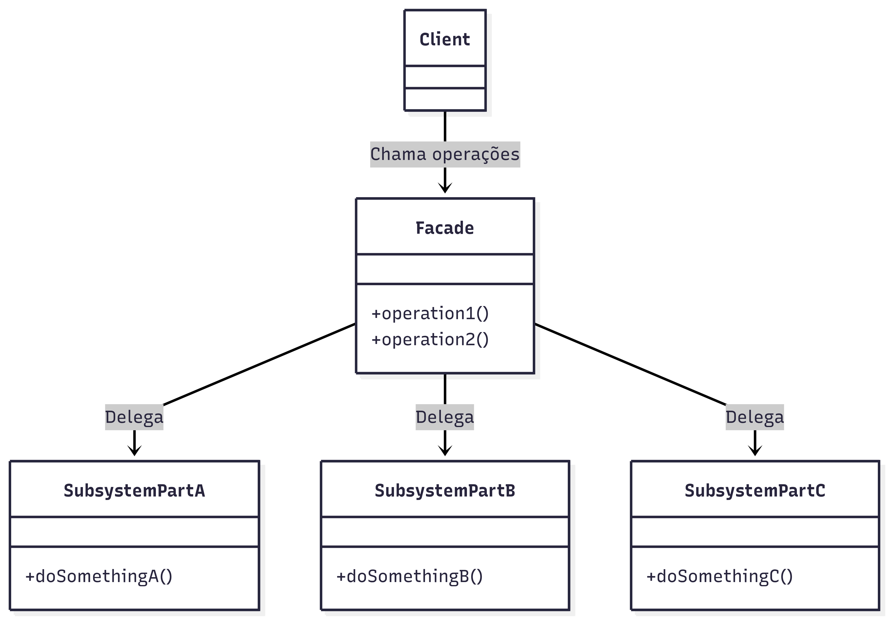
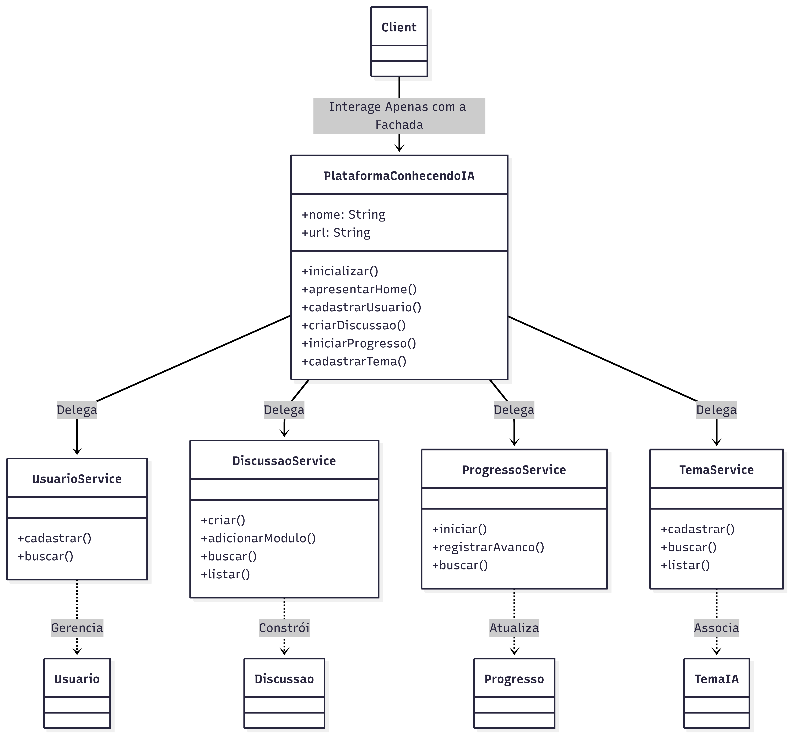

# 3.2.3 Facade

## 1. Visão Geral do Padrão Facade

Classificado como um padrão de projeto **estrutural**, o Facade (ou Fachada) tem como principal objetivo disponibilizar uma interface limpa, unificada e de alto nível para ocultar a complexidade de um ou mais subsistemas [[1]](#ref1). Dessa forma, ele atua como um "escudo" que poupa o cliente de lidar com as particularidades de classes internas, entregando uma forma de uso muito mais acessível.

A metáfora do nome é bem direta: assim como a fachada de um prédio esconde todo o emaranhado de canos e fiações que fazem o edifício funcionar, o padrão esconde as engrenagens do sistema do mundo externo.

### 1.1. Contexto e Problema Solucionado

Na medida em que uma aplicação cresce, seus subsistemas tendem a se tornar densos e altamente acoplados. Se a parte consumidora (o código cliente) precisar instanciar diversas classes, injetar dependências manuais e orquestrar as chamadas na ordem correta, o nível de acoplamento do projeto dispara. Qualquer alteração nas lógicas internas forçaria uma refatoração massiva no código cliente.

O Facade surge justamente para mitigar esse caos [[3]](#ref3). Ele centraliza as invocações complexas em métodos de fácil compreensão, assumindo a responsabilidade de repassar as ordens aos subsistemas apropriados reduzindo a necessidade de interação direta com as classes internas do sistema.

### 1.2. Atores do Padrão

A estrutura clássica do Facade é composta pelos seguintes elementos:

* **Facade (A Fachada):**
    * Atua como o maestro do sistema. Conhece o papel de cada classe interna e encaminha os pedidos para o especialista correto.
    * Importante: a fachada não deve abrigar lógica de negócio primária [[2]](#ref2). Ela apenas orquestra e delega chamadas.
* **Classes do Subsistema (Especialistas):**
    * Realizam o "trabalho pesado" e contêm as regras de negócio reais.
    * Atuam de forma independente e não sabem da existência da classe Facade. Se desejado, o cliente mais avançado ainda pode acessá-las diretamente.
* **Client (Consumidor):**
    * A interface, o controlador ou o desenvolvedor que interage com o sistema usando estritamente os métodos amigáveis fornecidos pela Fachada.

### 1.3. Diagrama UML

Abaixo, um diagrama UML detalhando a estrutura padrão do Facade:

<center>



</center>

<font size="3"><p style="text-align: center"><b>Autores</b>: Arthur Fernandes Alencar, Mariana Pereira da Silva e Vinícius Pereira Ribeiro, 2026.</p></font>

#### O que o Diagrama nos mostra?

- O **Client** foca apenas no que ele quer fazer, pedindo isso ao **Facade**.
- O **Facade**, que contém os atalhos para o subsistema, aciona as partes necessárias (`SubsystemPartA`, `SubsystemPartB`, `SubsystemPartC`).
- Todo o processamento paralelo ou sequencial necessário para completar `operation1()` fica blindado dentro do Facade, devolvendo apenas o resultado pronto para o cliente.

### 1.4. Dinâmica de Funcionamento

O fluxo prático ocorre nas seguintes etapas:
1. Uma requisição complexa surge no Cliente.
2. O Cliente invoca um método autoexplicativo no Facade.
3. O Facade recebe a instrução, "traduz" para as peças internas do software e dispara os métodos na sequência exata.
4. O subsistema processa a regra de negócio e finaliza a ação.
5. Se houver dados de retorno, o Facade agrupa os resultados e entrega ao Cliente de forma simplificada.

### 1.5. Principais Vantagens

- **Diminuição da Curva de Aprendizado:** Um desenvolvedor novo não precisa estudar toda a árvore do sistema para começar a usá-lo; basta olhar os métodos do Facade.
- **Baixo Acoplamento:** Como o cliente conversa apenas com a Fachada, o time pode refatorar completamente as classes do subsistema sem quebrar as rotas ou a interface gráfica.
- **Isolamento de Responsabilidades:** Contribui fortemente para a arquitetura em camadas, definindo um ponto fixo de fronteira entre a lógica interna e a apresentação.

### 1.6. Pontos de Atenção (Desvantagens)

- **O Risco do "God Object":** Uma falha clássica é colocar o sistema INTEIRO dentro de uma única Fachada. Se a classe Facade concentrar métodos demais, ela se torna o que chamamos de "God Object" (Classe Deus), virando um gargalo de manutenção gigantesco.
- **Redundância:** Em projetos extremamente pequenos e simples, criar uma Fachada pode ser apenas um trabalho burocrático de repassar chamadas (simples encaminhamento de chamadas), não agregando valor arquitetural real.
- **Perda de Granularidade:** Ocultar métodos avançados pode frustrar necessidades específicas do cliente, embora o padrão não proíba o acesso direto ao subsistema caso estritamente necessário.

---

## 2. Aplicações do Padrão Facade no Projeto

Nesta seção, detalharemos a implementação do Facade dentro do projeto **ConhecendoIA** [[4]](#ref4).

### 2.1. Facade na Lógica Central: Simplificando a Interação com Subsistemas (src/lib/facade.js)

> 1. **Link da pasta do código:** [Frontend `src/lib/`](https://github.com/UnBArqDsw2026-1-Turma02/2026.1_T02_G3_ConhecendoIA_Entrega_3/tree/main/frontend/src/lib)
>

No projeto, o arquivo `facade.js` atua como uma **Fachada** para centralizar as interações com os variados serviços da plataforma, como gerenciar discussões, progresso, temas e usuários.

#### 2.1.1. Contexto do Problema

A aplicação depende de diversas classes de serviço, que manipulam diferentes áreas:
- **`DiscussaoService`:** Lida com a criação e montagem de discussões (utilizando o padrão Builder).
- **`UsuarioService`:** Cadastra e gerencia o armazenamento de usuários.
- **`ProgressoService`:** Inicia, registra avanços e busca o progresso associando Usuários a Discussões (utilizando o padrão Observer).
- **`TemaService`:** Cadastra e lista temas e seus conteúdos.

Se um cliente (por exemplo, a interface do usuário ou o ponto de entrada da aplicação) tivesse que interagir diretamente com todas essas classes, ele precisaria instanciá-las individualmente e saber qual serviço faz o quê, resultando em um forte acoplamento e um código cliente desnecessariamente complexo.

O Facade resolve isso encapsulando essas classes em `PlataformaConhecendoIA`.

#### 2.1.2. A Fachada em Ação (`facade.js`)

A `PlataformaConhecendoIA` centraliza as instâncias dos serviços em seu construtor e provê métodos muito diretos para que o cliente realize as ações, delegando as requisições para o respectivo serviço sob o capô:

```javascript
class PlataformaConhecendoIA {
  constructor(nome, url) {
    this.nome = nome;
    this.url = url;
    this._discussaoService  = new DiscussaoService();
    this._usuarioService    = new UsuarioService();
    this._progressoService  = new ProgressoService();
    this._temaService       = new TemaService();
  }

  // --- Usuário ---
  cadastrarUsuario(id, nome, email, senhaHash) {
    return this._usuarioService.cadastrar(id, nome, email, senhaHash);
  }

  // --- Discussão ---
  criarDiscussao(id, nome, objetivo, nivel) {
    return this._discussaoService.criar(id, nome, objetivo, nivel);
  }

  // ... (outros métodos como iniciarProgresso, cadastrarTema, etc)
}
```

O cliente, ao invés de instanciar cada serviço, utiliza a fachada dessa maneira:

```javascript
// O cliente conhece APENAS a PlataformaConhecendoIA
const plataforma = new PlataformaConhecendoIA("Conhecendo IA", "https://conhecendoia.com");

// Inicialização
plataforma.inicializar();

// Usando o subsistema de usuários
const arthur = plataforma.cadastrarUsuario(1, "Arthur", "arthur@email.com", "hash123");

// Usando o subsistema de discussões
const discussao = plataforma.criarDiscussao("d1", "Fundamentos de IA", "Aprender IA do zero", "iniciante");

// Usando o subsistema de temas
plataforma.cadastrarTema("t1", "Redes Neurais", "Como as redes neurais aprendem");

// Usando o subsistema de progresso
plataforma.iniciarProgresso(arthur, discussao);
plataforma.registrarAvanco(arthur.id, discussao.id, 60);

// Relatório
const progresso = plataforma.consultarProgresso(arthur.id, discussao.id);
console.log(progresso.gerarRelatorio());
```

#### 2.1.3. Diagrama UML da Aplicação

Abaixo o diagrama de classes que representa o novo uso da Fachada na arquitetura central da plataforma ConhecendoIA:

<center>



</center>

<font size="3"><p style="text-align: center"><b>Autores</b>: Arthur Fernandes Alencar, Mariana Pereira da Silva e Vinícius Pereira Ribeiro, 2026.</p></font>

#### Explicação do Diagrama:

- O **Client** (que representa o script principal ou interface) não se comunica diretamente com os múltiplos serviços de gestão do sistema. Ele interage exclusivamente com a **PlataformaConhecendoIA**.
- A **PlataformaConhecendoIA** atua como a fachada do sistema, expondo métodos unificados e simplificados (como `cadastrarUsuario()` ou `criarDiscussao()`).
- Por baixo dos panos, a fachada detém as referências e delega as chamadas para as classes especialistas do subsistema: **DiscussaoService**, **UsuarioService**, **ProgressoService** e **TemaService**.
- Dessa forma, o Cliente fica isolado da complexidade interna e das regras de negócio (como o uso do `DiscussaoBuilder` e os Observers do Progresso), precisando conhecer apenas uma única interface para orquestrar todas as operações.

#### 2.1.4. Benefícios Obtidos

- **Simplicidade de Uso:** Todo o sistema pode ser orquestrado com apenas uma instância (`plataforma`).
- **Encapsulamento Complexo:** A integração com outros padrões — como o Builder sendo acionado dentro do `DiscussaoService` ou o Email Observer que é ativado no `ProgressoService` — fica totalmente transparente para o Cliente.
- **Alta Coesão e Baixo Acoplamento:** As regras do negócio estão coesas em seus respectivos serviços e modelos (`Conteudo`, `RecursoInterativo`, `Modulo`), mas o acoplamento do cliente a tudo isso é nulo, já que ele depende apenas da Fachada.

#### 2.1.5. Demonstração Prática (Vídeo)

No vídeo abaixo, demonstramos a aplicação prática da Fachada (`PlataformaConhecendoIA`), orquestrando as funcionalidades de usuário, discussões, progresso e temas em tempo real.

<center>
  <a href="https://youtu.be/DdYFlWQm0n8?si=ltkIt0Ow1OXwX1UI" target="_blank">
    
  </a>
  <br/><br/>
  <strong>Link do vídeo:</strong> <a href="https://youtu.be/DdYFlWQm0n8?si=ltkIt0Ow1OXwX1UI" target="_blank">https://youtu.be/DdYFlWQm0n8?si=ltkIt0Ow1OXwX1UI</a>
</center>

---

## 3. Referências Bibliográficas

<a id="ref1"></a>[1] GAMMA, E.; HELM, R.; JOHNSON, R.; VLISSIDES, J. Design Patterns: Elements of Reusable Object-Oriented Software. Reading, MA: Addison-Wesley, 1995.

<a id="ref2"></a>[2] FREEMAN, E.; ROBSON, E.; BATES, B.; SIERRA, K. Head First Design Patterns. Sebastopol, CA: O'Reilly Media, 2004.

<a id="ref3"></a>[3] REFACTORING GURU. Facade Pattern. Refactoring Guru, [s.d.]. Disponível em: https://refactoring.guru/design-patterns/facade. Acesso em: 21 mai. 2026.

<a id="ref4"></a>[4] SERRANO, Milene. Arquitetura e Desenho de Software - Aula GoFs Estruturais. [Material de aula em PDF]. Brasília: UnB Gama.

## 4. Histórico de Versões

| Versão | Data       | Descrição                                                    | Autor  | 
|--------|------------|--------------------------------------------------------------|--------|
| 1.0    | 21/05/2026 | Criação do documento com a introdução e exemplo do Builder | [Mariana Pereira](https://github.com/marianaps2701), [Arthur Fernandes](https://github.com/hisarxt), [Vinícius Ribeiro](https://github.com/viniiribeiro), [João Guilherme Capozzi](https://github.com/jonas3688) |  
